# Pulse — HIIT Interval Timer User Guide

## Welcome to Pulse

Pulse is a focused interval timer for HIIT (High-Intensity Interval Training) workouts on iOS and Android. HIIT means alternating short bursts of intense exercise with brief recovery periods — Pulse tracks every second so you can focus entirely on moving.

Pulse runs entirely on your device, stays accurate even when you background the app mid-workout, and vibrates and beeps through every phase transition so you never have to glance at your screen.

## Getting Started

When you open Pulse for the first time you land on the Home screen. Three ready-to-go workouts are already loaded:

| Workout          | Rounds | Work | Rest | Round Rest |
| ---------------- | ------ | ---- | ---- | ---------- |
| Tabata Classic   | 8      | 20 s | 10 s | —          |
| EMOM 40/20       | 10     | 40 s | 20 s | 60 s       |
| Pyramid 30/20/10 | 3      | 30 s | 15 s | 60 s       |

The large card on the Home screen shows your most recently used workout. On first launch one of the three built-in workouts appears on the card with a prompt to customise it before starting. After your first workout, the card always updates to show the last workout you ran. Tap **▶ Start** to begin immediately — no setup required.

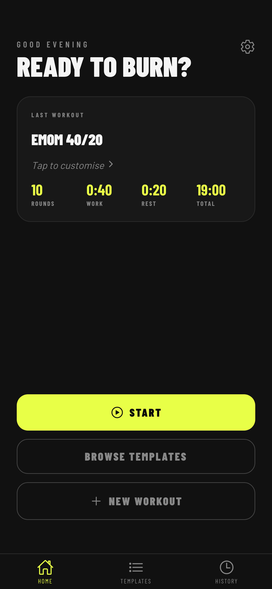

## Running Your First Workout

1. Tap **▶ Start** on the Home screen.
2. Pulse plays a short **PREPARE** countdown (orange screen) so you can get into position.
3. When the countdown hits zero, **WORK** begins (yellow-green screen) — give it everything you have.
4. After the work interval, **REST** starts (blue screen) — catch your breath.
5. Work and rest repeat for every exercise in the round.
6. After the last exercise in a round, a **ROUND REST** (purple screen) gives you a longer recovery before the next round starts. If Round Rest is set to 0 s (like Tabata Classic) this phase is skipped entirely.
7. When all rounds are done, Pulse shows a **FINISH** screen and takes you straight to your Summary.

### Reading the timer screen

- **Countdown** — the large number in the centre counts down the current phase.
- **Progress ring** — the arc around the countdown moves clockwise with the phase. In countdown mode it depletes as time runs out; in countup mode it fills as time accumulates.
- **Round dots** — a row of dots at the bottom, one per round. The active round is a highlighted pill; completed rounds are dimmed; upcoming rounds are empty circles.
- **Phase label** — the word above the countdown tells you which phase you are in.
- **Screen colour** — changes on every phase transition so you know your current phase at a glance without reading anything.
<table>
  <tr>
    <td>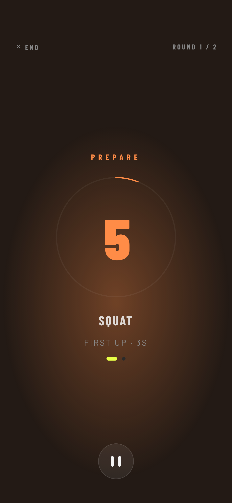</td>
    <td>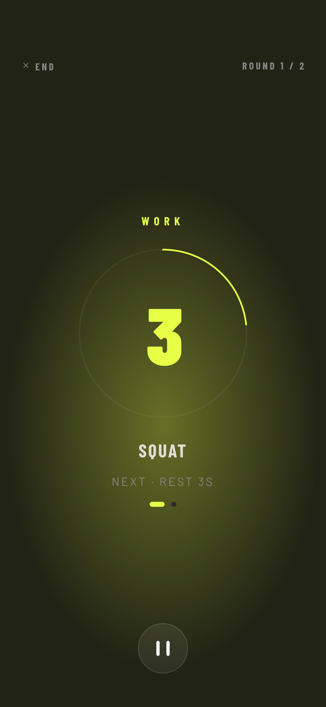</td>
    <td>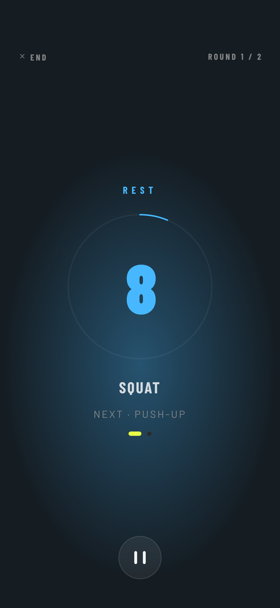</td>
    <td>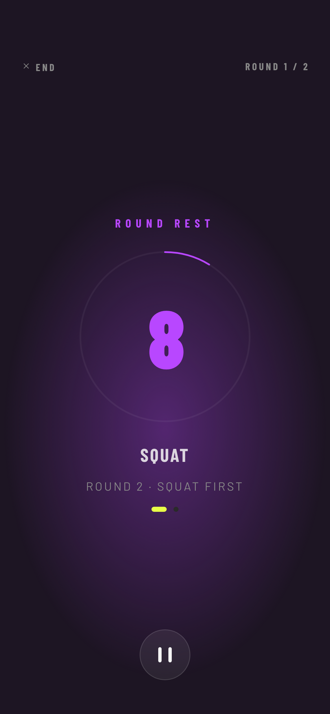</td>
    <td>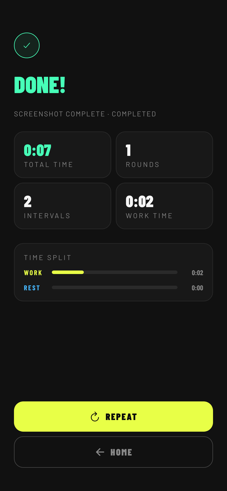</td>
  </tr>
  <tr>
    <td align="center">Prepare</td>
    <td align="center">Work</td>
    <td align="center">Rest</td>
    <td align="center">Round Rest</td>
    <td align="center">Summary Screen</td>
  </tr>
</table>

## Pausing and Ending Early

Tap the **pause button** at the bottom of the timer screen to freeze the countdown. The screen dims to grey.

From the paused state you have two options:

- **▶ Resume** — picks up from exactly where you paused with zero drift.
- **End Workout** — stops the session immediately and takes you to the Summary screen. The session is saved as a partial workout.
  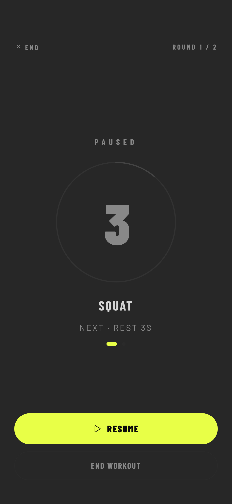
  You can also tap **✕ End** in the top-left corner at any time while the timer is running. This pauses the workout first and asks for confirmation before ending.

When you end a workout early, the Summary shows how many rounds you completed and how much time you spent in work and rest. The session is marked as incomplete but still saved to your History.

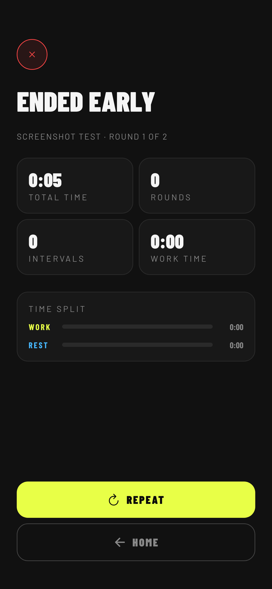

## Browsing Templates

The built-in workout templates give you a starting point for any training style. Tap **Browse Templates** on the Home screen or the **Templates** tab in the bottom navigation to see the full list.

- Use the filter chips at the top to narrow by category: **All**, **Tabata**, **EMOM**, **AMRAP**, **Custom**.
- Type in the search bar to filter by workout name.
- Tap any card to open a preview sheet at the bottom of the screen.
  
  The preview sheet shows the full workout config — rounds, work, rest, round rest, and exercises. From here you can:

- **▶ Start** — begin the workout immediately.
- **Duplicate & Edit** — copy the workout into the Builder so you can tweak it before starting. The original workout is unchanged.
  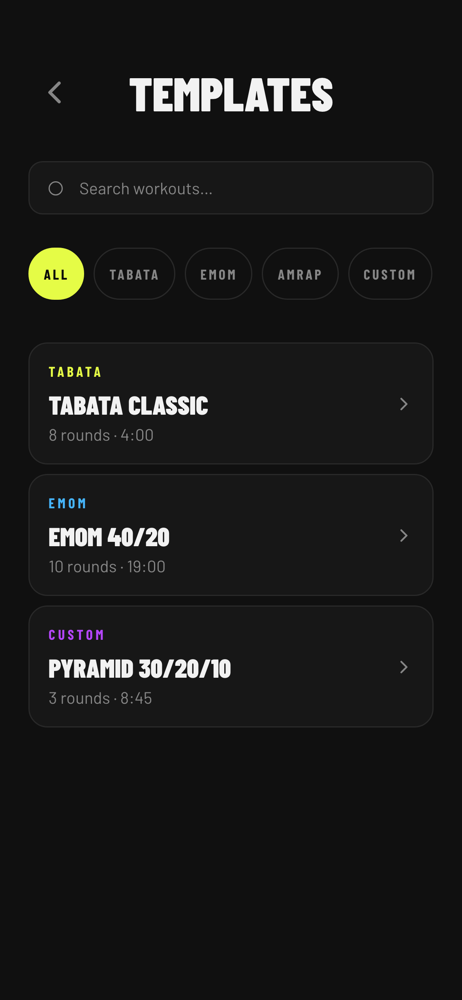

## Creating a Custom Workout

Tap **+ New Workout** on the Home screen to open the Builder in create mode. You can also tap **Duplicate & Edit** from any template preview to start from an existing workout as a base.

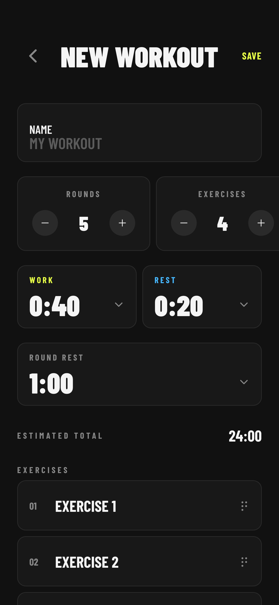

### What you can configure

| Field          | What it does                                                                  |
| -------------- | ----------------------------------------------------------------------------- |
| **Name**       | A label for your workout — shown on the Home card and in History.             |
| **Rounds**     | How many times the full exercise sequence repeats.                            |
| **Exercises**  | How many exercises per round. Each gets its own name field below the stepper. |
| **Work**       | How long each exercise lasts.                                                 |
| **Rest**       | Recovery time between exercises within a round.                               |
| **Round Rest** | Recovery time between rounds. Set to 0 s to skip it entirely.                 |

The **Total** time estimate at the bottom of the form updates live as you adjust values.

### Naming exercises

Tap any exercise name in the list to rename it inline. This name appears on the timer screen during that exercise so you always know what to do next. If you leave a name blank it resets to the default.

### Reordering exercises

Hold and drag the handle on the right side of any exercise row to change its order within the round.

### Saving

- **Save** — saves the workout and returns to the previous screen. The workout appears on the Home card ready to start.
- **▶ Start** — saves the workout and launches the timer immediately.
  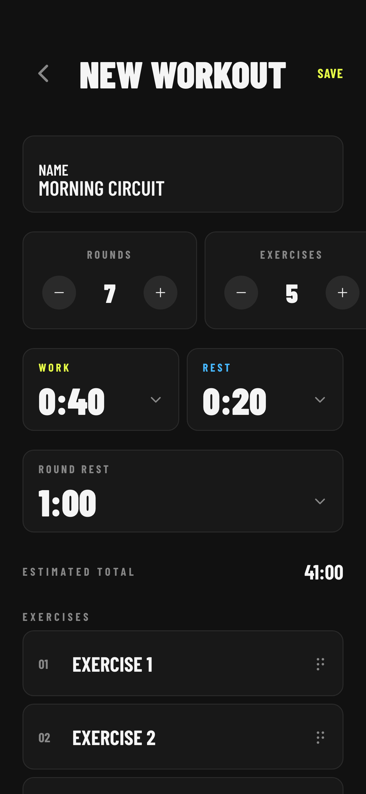

### Editing an existing workout

To edit a workout you have already created, find it in the Templates screen, tap the card, and choose **Duplicate & Edit** from the preview sheet. This creates an editable copy — the original remains unchanged. To replace the original, delete it from Templates after saving the edited version.

## Your History

Every completed or partial session is saved to History automatically. Tap the **History** tab in the bottom navigation to see your past workouts. If you have completed sessions today, a badge on the History tab shows the count.

Sessions are grouped by date, newest first. Each row shows:

- **Workout name**
- **Time** the session was completed
- **Total duration**
- **Rounds completed** — shown as `3 / 8 rounds` for partial sessions, `8 rounds` for complete sessions
- A **COMPLETE** or **PARTIAL** badge
  Tap any session row to open the full Summary for that session.

To delete all history, tap **Clear** in the top-right corner of the History screen. This removes all session records permanently but does not affect your saved workouts.

## Settings

Tap the **gear icon** in the top-right corner of the Home screen to open Settings.

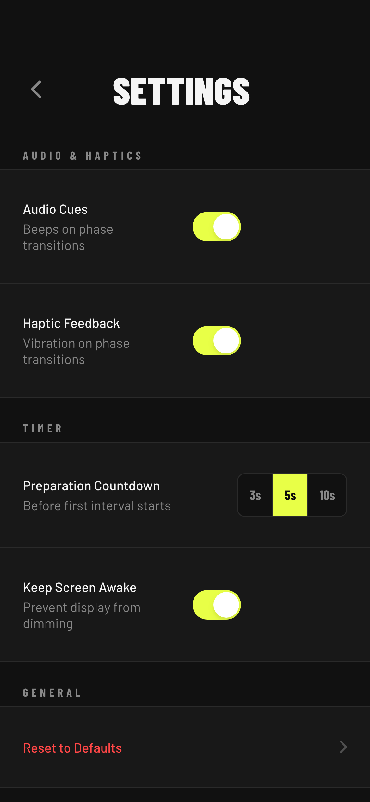

| Setting                   | What it does                                                                                                                         |
| ------------------------- | ------------------------------------------------------------------------------------------------------------------------------------ |
| **Audio Cues**            | Plays a beep on every phase transition. Turn off for a silent workout.                                                               |
| **Haptic Feedback**       | Vibrates the phone on every phase transition. Works even when the phone is silenced.                                                 |
| **Preparation Countdown** | Sets how long the get-ready countdown lasts before the first WORK phase. Options: 3 s, 5 s, 10 s. Default is 5 s.                    |
| **Keep Screen Awake**     | Prevents the display from dimming while a workout is running. Recommended — lets you glance at the timer without touching the phone. |
| **Reset to Defaults**     | Restores all settings to their initial values. Does not delete your workouts or History.                                             |

## Troubleshooting

**Notifications don't appear when the app is backgrounded**
Go to your device Settings → Notifications → Pulse and make sure notifications are allowed. Pulse requests permission the first time you start a workout — if you denied it, you can re-enable it here.

**The timer seemed off after I got a phone call**
Pulse resyncs from an absolute timestamp when it returns to the foreground, so the countdown should be accurate regardless of how long the interruption lasted. If the workout had already finished during the call, Pulse takes you directly to the Summary screen on return.

**Audio doesn't play**
Check that Audio Cues is enabled in Settings. Also check your device's silent switch — Pulse respects the hardware mute setting on iOS.

**I accidentally deleted a workout**
Deleted workouts cannot be recovered. If you deleted a built-in template (Tabata Classic, EMOM 40/20, Pyramid 30/20/10), you can recreate it manually in the Builder using the values in the Getting Started table above.

## Tips

- **Use Round Rest for circuits** — if you need longer recovery between rounds (e.g. strength circuits), set Round Rest to 60 s or more.
- **Set Round Rest to 0 for Tabata** — classic Tabata has no inter-round rest, only 10 s between exercises.
- **Haptics work silently** — leave your phone on silent and still feel every phase change through vibration.
- **Background safe** — Pulse schedules a notification for each phase transition so you are alerted even if you lock your screen mid-workout.
- **History badge** — the History tab shows a badge with how many sessions you have logged today, including partial ones.
- **Create variations from templates** — use Duplicate & Edit on any built-in template to create your own version without losing the original.
- **Rename exercises** — give exercises real names (Burpees, Jump Squats, Mountain Climbers) so the timer screen tells you exactly what to do next.
